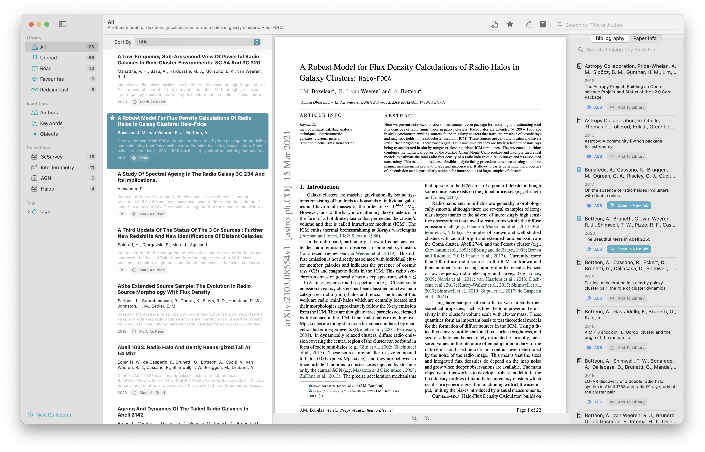

# Citer (SwiftUI application)
## Astronomical Reference manager for MacOS

Reference manager written in swift developed for MacOS.
This reference manager makes use of the ADS/SAO NASA API service to get all publication information and therefore is tailored for **astronomical research**. To be able to use the ADS API functionallity, add your personal ADS API Token in the settings.

